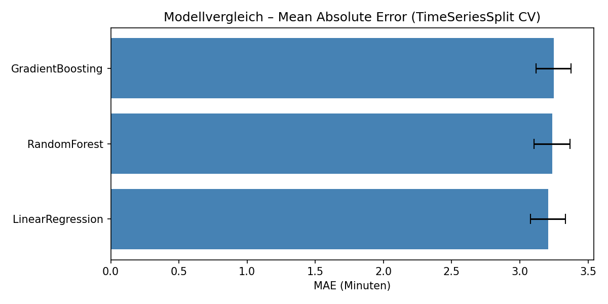
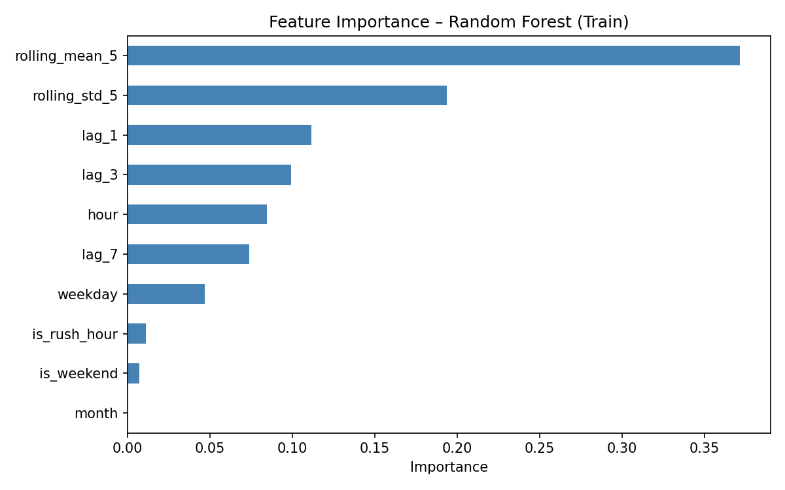
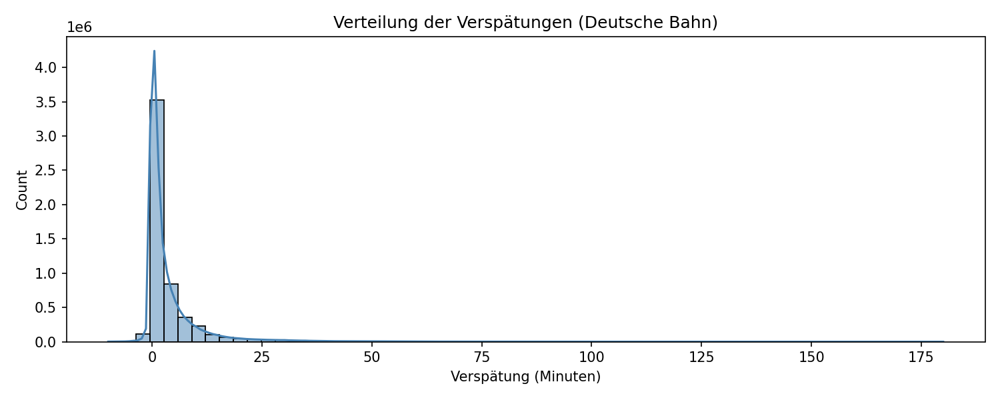
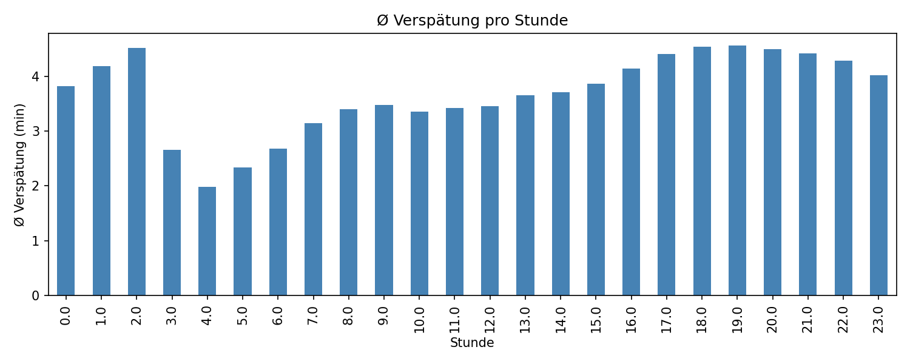
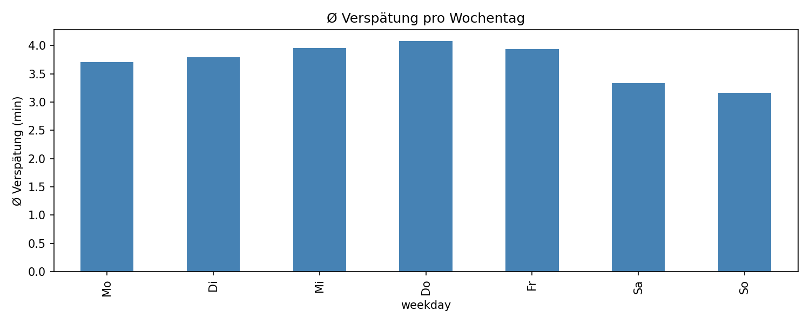
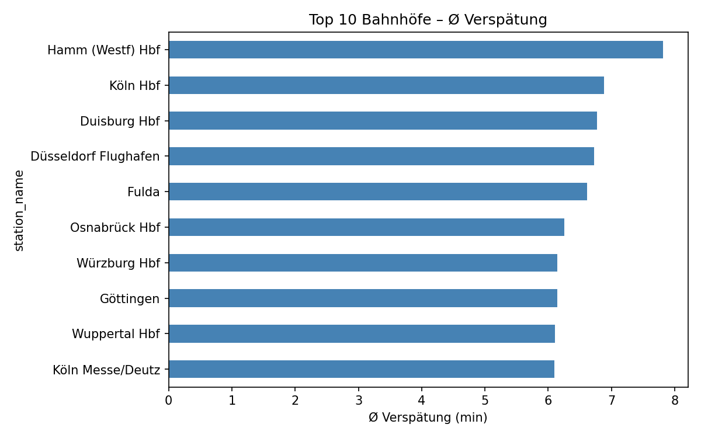

# db-delay-forecaster

**Forecast departure delay (minutes)** — scikit-learn regression on open [Deutsche Bahn–style trip data](https://huggingface.co/datasets/piebro/deutsche-bahn-data), with a **time-ordered holdout** so metrics reflect temporal drift, not random shuffling.

## Results (holdout, time-ordered test split)

Example run using the same pipeline as `main.py`, with `build_features(..., max_rows=400000)` to fix a reproducible slice (full-data metrics are similar but not identical).

| Model | MAE (min) | RMSE (min) | R² |
| --- | ---: | ---: | ---: |
| Baseline (mean) | 4.53 | 9.96 | −0.00 |
| Baseline (lag-1) | 5.42 | 13.46 | −0.83 |
| LinearRegression | 3.55 | 7.89 | 0.37 |
| RandomForest | 3.60 | 8.15 | 0.33 |
| HistGradientBoosting | 3.61 | 7.97 | 0.36 |

vs. mean-only baseline, best ML model (LinearRegression here): **~22% lower MAE** on this slice.

### Plots (in repo)













After a full `python main.py` run, `holdout_predictions.png` may appear in `outputs/plots/` as well.

---

## Problem / goal

### English

**Target:** Predict **delay in minutes** (`delay_in_min`) for a **planned departure** — i.e. how late the train is expected to be when it leaves, using **historical** rows from the same dataset (past departures with known delay).  
This is **not** network-wide simulation; it is **row-level regression** on cleaned trip records.

### Deutsch

**Zielvariable:** **Verspätung in Minuten** bei einer **geplanten Abfahrt** (`delay_in_min`): wie viele Minuten Verspätung für diese Abfahrt zu erwarten sind, geschätzt aus **historischen** Einträgen desselben Datensatzes.  
Es geht um **Regression pro Fahrt**, nicht um ein komplettes Netzmodell.

---

## Business use case

### English

Better **expected delay** at departure is not just a model score — it supports decisions where minutes matter:

- **Operations & connections:** smoother dispatch and **connection planning** when downstream legs (and their passengers or freight) depend on realistic departure times.
- **Resource planning:** aligning crews, rolling stock, and platform capacity with **anticipated disruption**, not only with static timetables.
- **Customer information:** more reliable **“current delay”** style estimates for apps and station displays, so expectations match reality more often.
- **Punctuality KPIs & reporting:** forecasting supports **measuring and improving** on-time performance targets with clearer baselines than a fixed mean delay.

This repo is a **learning / portfolio** pipeline on open data; production systems would add live feeds, line-level grouping, and stricter governance.

### Deutsch

Eine bessere **erwartete Verspätung** bei der Abfahrt ist mehr als eine Metrik — sie steht für Entscheidungen, bei denen **Minuten zählen**:

- **Betrieb & Anschlüsse:** bessere Disposition und **Anschlussplanung**, wenn Folgezüge (und Reisende oder Güter) auf realistische Abfahrtszeiten angewiesen sind.
- **Ressourcenplanung:** Personal, Fahrzeugumlauf und Gleisbelegung stärker an **erwartete Störungen** statt nur am statischen Fahrplan ausrichten.
- **Kundeninformation:** verlässlichere **Verspätungsprognosen** für Apps und Anzeigen — Erwartung und Realität näher zusammenbringen.
- **Pünktlichkeits-KPIs:** Prognosen helfen, **Ziele zur Pünktlichkeit** zu messen und zu verbessern — mit klareren Bezugsgrößen als ein fester Mittelwert.

Dieses Repo ist eine **Lern- / Portfolio-Pipeline** auf offenen Daten; produktive Systeme brächten Live-Daten, granulare Gruppierung (z. B. Linie/Strecke) und klarere Governance hinzu.

---

## TL;DR / Kurzfassung

### English

After `main.py`, you get holdout **MAE / RMSE / R²**, two **naive baselines** (see below), and sklearn models. **MAE** ≈ typical error in minutes; lower is better.

**Baselines (required for context):**

- **Baseline (mean):** always predict the **mean delay on the training period** (`DummyRegressor`). If ML is not better than this, the features are not pulling their weight.
- **Baseline (lag-1):** predict delay = **previous row’s delay** in time order (persistence). Often strong on time-series-like data; ML should ideally beat or match it when the extra features help.

**Interpretation (typical patterns — check your own `outputs/plots/feature_importance.png` and console “Top features”):**

- **Lag / rolling features** usually rank high: delay is **autocorrelated**.
- **Hour / rush hour** often matter: load peaks and knock-on delays.
- If **RandomForest** beats **linear** models, there are **nonlinear** interactions; if scores are close, the problem may be **mostly linear** after features.

See **Results** above for a filled example; `main.py` prints fresh numbers for your data.

- Example (400k-row slice): best ML MAE ≈ **3.55 min**; **~22%** lower MAE than mean baseline.

---

### Deutsch

Nach `main.py` gibt es Holdout-Metriken, **zwei naive Baselines** und die ML-Modelle. **MAE** ist grob der typische Fehler in **Minuten**; kleiner ist besser.

**Baselines:**

- **Baseline (mean):** immer den **Mittelwert** der Verspätung auf dem **Trainings**zeitraum vorhersagen. Wenn ML das nicht schlägt, bringen die Features wenig.
- **Baseline (lag-1):** Verspätung = **vorherige** Verspätung in der Zeitreihe (Persistence). Oft stark; ML sollte das idealerweise übertreffen oder annähern, wenn Zusatzfeatures helfen.

**Einordnung (typisch — eigene Plots/Top-Features prüfen):**

- **Lag- und Rolling-Features** stehen oft oben: Verspätung hängt stark vom **Vergangenheits**verlauf ab.
- **Stunde / Rush Hour** zeigen oft Last und Folgeverspätungen.
- Wenn **RandomForest** klar besser ist als **LinearRegression**, spielen **nichtlineare** Effekte mit; bei ähnlichen Scores dominiert oft ein **lineares** Signal nach Feature-Aufbereitung.

Siehe **Results** oben. Beispiel (400k-Zeilen-Slice): bestes ML-Modell hier **LinearRegression**, MAE ≈ **3,55 min**; **~22 %** weniger MAE als Mean-Baseline. Vollständiger Lauf: Werte aus `main.py` übernehmen.

---

## Project description

Data: [piebro/deutsche-bahn-data](https://huggingface.co/datasets/piebro/deutsche-bahn-data) (CC BY 4.0).  
Python 3.10 or newer; packages are listed in `requirements.txt`.

```bash
git clone https://github.com/YOUR_USERNAME/db-delay-forecaster.git
cd db-delay-forecaster
```

Create a venv, then run the commands from the project root so the paths to `data/` and `outputs/` stay correct. If you prefer notebooks, copy the imports from `eda.py` / `main.py` and run with the working directory set to this folder (or fix `sys.path` yourself).

```bash
pip install -r requirements.txt
python data/download.py
python eda.py
python main.py
```

You get tables in the terminal (including baselines) and plots under `outputs/plots/`.

### Example: one prediction (`model.predict`)

After data is downloaded, you can train the same way as `main.py` and call `predict` on a feature row (here: first row of the holdout split). **Input** is only the feature columns, not the future delay.

```python
from pathlib import Path
import glob
import sys

ROOT = Path("/path/to/db-delay-forecaster")  # or Path(__file__).resolve().parents[0]
sys.path.insert(0, str(ROOT / "src"))

from features import (
    FEATURE_COLS,
    TARGET_COL,
    TIME_COL,
    build_features,
    temporal_train_test_split,
)
from train import get_models

paths = sorted(glob.glob(str(ROOT / "data/raw/monthly_processed_data/*.parquet")))
df = build_features(paths)
train_df, test_df = temporal_train_test_split(df, time_col=TIME_COL, test_size=0.15)

model = get_models()["RandomForest"]
model.fit(train_df[FEATURE_COLS], train_df[TARGET_COL])

sample = test_df.iloc[[0]]  # one departure
minutes_late = model.predict(sample[FEATURE_COLS])[0]
print(round(float(minutes_late), 2), "min predicted delay")
```

Runnable copy in the repo: `python examples/predict_one.py` (from the project root, with Parquet data present).

---

## Projektbeschreibung

Daten: [piebro/deutsche-bahn-data](https://huggingface.co/datasets/piebro/deutsche-bahn-data) (CC BY 4.0).  
Python 3.10+, Pakete stehen in `requirements.txt`.

```bash
git clone https://github.com/YOUR_USERNAME/db-delay-forecaster.git
cd db-delay-forecaster
```

Venv anlegen, Befehle vom **Projektroot** ausführen. Jupyter: Inhalt aus `eda.py` / `main.py` übernehmen; Arbeitsverzeichnis / `sys.path` anpassen.

```bash
pip install -r requirements.txt
python data/download.py
python eda.py
python main.py
```

Ausgabe: Metriken inkl. Baselines im Terminal, Grafiken unter `outputs/plots/`.

### Beispiel: eine Vorhersage (`model.predict`)

Wenn die Daten liegen, kannst du wie in `main.py` trainieren und für **eine** Zeile aus dem Holdout `predict` aufrufen — **Eingabe** sind nur die Feature-Spalten, nicht die künftige Verspätung.

```python
from pathlib import Path
import glob
import sys

ROOT = Path("/pfad/zu/db-delay-forecaster")
sys.path.insert(0, str(ROOT / "src"))

from features import (
    FEATURE_COLS,
    TARGET_COL,
    TIME_COL,
    build_features,
    temporal_train_test_split,
)
from train import get_models

paths = sorted(glob.glob(str(ROOT / "data/raw/monthly_processed_data/*.parquet")))
df = build_features(paths)
train_df, test_df = temporal_train_test_split(df, time_col=TIME_COL, test_size=0.15)

model = get_models()["RandomForest"]
model.fit(train_df[FEATURE_COLS], train_df[TARGET_COL])

sample = test_df.iloc[[0]]
minutes_late = model.predict(sample[FEATURE_COLS])[0]
print(round(float(minutes_late), 2), "Min. vorhergesagte Verspätung")
```

Im Repo ausführbar: **`python examples/predict_one.py`** (vom Projektroot, Parquet-Daten vorausgesetzt).

---

## GitHub repository settings (web UI)

Git metadata cannot set these; paste on the repo page **About →** gear icon:

- **Description:** `Train delay forecasting (minutes) for planning, KPIs & passenger-facing estimates — scikit-learn, open Deutsche Bahn–style data, time-based holdout.`
- **Topics:** `python` `machine-learning` `scikit-learn` `time-series` `regression` `pandas` `forecasting` `deutsche-bahn` `delay-prediction` `operations-research`

This helps search and looks more complete to visitors.
